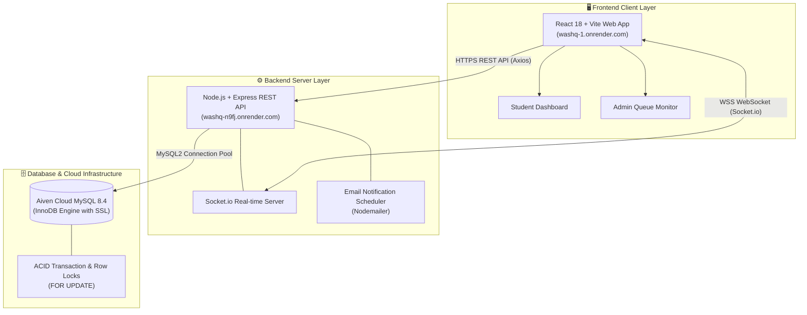

# 📦 WashQ - เอกสารส่งมอบงานระบบ (Project Handover Document)

> **โครงการ:** ระบบจองคิวเครื่องซักผ้าอัจฉริยะสำหรับหอพักนักศึกษา (WashQ - Smart Laundry Queue Reservation System)  
> **หน่วยงานผู้รับมอบ:** หอพักนักศึกษา มหาวิทยาลัยเทคโนโลยีราชมงคลล้านนา  
> **เวอร์ชันส่งมอบ:** Version 1.0.0 (Final Release - Sprint 3)  
> **วันที่ส่งมอบ:** 6 ตุลาคม 2026  
> **สถานะโครงการ:** ส่งมอบงานสมบูรณ์ (Completed & Handed Over)

---

## 📑 สารบัญ (Table of Contents)
1. [ข้อมูลทั่วไปของโครงการ (Project Information)](#1-ข้อมูลทั่วไปของโครงการ-project-information)
2. [วัตถุประสงค์และขอบเขตงานที่ส่งมอบ (Scope of Deliverables)](#2-วัตถุประสงค์และขอบเขตงานที่ส่งมอบ-scope-of-deliverables)
3. [รายการสิ่งที่ส่งมอบทั้งหมด (Deliverables Inventory)](#3-รายการสิ่งที่ส่งมอบทั้งหมด-deliverables-inventory)
4. [สถาปัตยกรรมระบบและเทคโนโลยี (System Architecture & Tech Stack)](#4-สถาปัตยกรรมระบบและเทคโนโลยี-system-architecture--tech-stack)
5. [ข้อมูลระบบบนสภาพแวดล้อมจริง (Production Environment Details)](#5-ข้อมูลระบบบนสภาพแวดล้อมจริง-production-environment-details)
6. [บัญชีผู้ใช้งานสำหรับทดสอบและตรวจรับงาน (Test Accounts)](#6-บัญชีผู้ใช้งานสำหรับทดสอบและตรวจรับงาน-test-accounts)
7. [ขั้นตอนการติดตั้งและเปิดใช้งานระบบ (Deployment & Running Guide)](#7-ขั้นตอนการติดตั้งและเปิดใช้งานระบบ-deployment--running-guide)
8. [คู่มือการดูแลรักษาและการปฏิบัติการ (Operations & Maintenance Guide)](#8-คู่มือการดูแลรักษาและการปฏิบัติการ-operations--maintenance-guide)
9. [สรุปผลการทดสอบระบบ (Quality Assurance & Test Summary)](#9-สรุปผลการทดสอบระบบ-quality-assurance--test-summary)
10. [ข้อจำกัดและข้อเสนอแนะในการต่อยอด (Limitations & Roadmap)](#10-ข้อจำกัดและข้อเสนอแนะในการต่อยอด-limitations--roadmap)
11. [แบบฟอร์มการตรวจรับและลงนามส่งมอบงาน (Acceptance Sign-Off)](#11-แบบฟอร์มการตรวจรับและลงนามส่งมอบงาน-acceptance-sign-off)

---

## 1. ข้อมูลทั่วไปของโครงการ (Project Information)

- **ชื่อโครงการภาษาไทย:** ระบบจองคิวเครื่องซักผ้าอัจฉริยะสำหรับหอพักนักศึกษา
- **ชื่อโครงการภาษาอังกฤษ:** WashQ - Smart Laundry Queue Reservation System
- **สถาบันการศึกษา:** มหาวิทยาลัยเทคโนโลยีราชมงคลล้านนา
- **กลุ่มเป้าหมายผู้ใช้งาน:**
  1. นักศึกษาที่พักอาศัยในหอพัก (Students)
  2. ผู้ดูแลหอพักและเจ้าหน้าที่ฝ่ายอาคารสถานที่ (Administrators)

---

## 2. วัตถุประสงค์และขอบเขตงานที่ส่งมอบ (Scope of Deliverables)

ระบบได้รับการพัฒนาและทดสอบครบถ้วนตามแผนการดำเนินงาน Sprint 1 ถึง Sprint 3 โดยครอบคลุมฟังก์ชันหลักดังนี้:

### 2.1 ระบบสำหรับนักศึกษา (Student Journey)
- [x] **ระบบยืนยันตัวตน (Authentication):** เข้าสู่ระบบด้วยรหัสนักศึกษาและรหัสผ่าน พร้อมระบบความปลอดภัย JWT
- [x] **การตรวจสอบสถานะเครื่องซักผ้าแบบ Real-time:** แสดงสถานะเครื่อง (ว่าง, กำลังซัก, มีคนจอง, ปิดซ่อม) แบบทันทีผ่าน WebSocket
- [x] **การจองคิวล่วงหน้า (Reservation System):** เลือกรอบเวลาและวันที่ล่วงหน้าได้สูงสุด 15 วัน พร้อมระบบป้องกันการจองวันในอดีต
- [x] **การป้องกันคิวซ้อน (Race Condition Protection):** ระบบประมวลผลด้วย Database Transaction และ Row Lock ป้องกันการแย่งจองพร้อมกัน 100%
- [x] **ระบบบัตรคิวและประวัติคิว (Queue Management):** แสดงบัตรคิว รหัสอ้างอิง `RES-XXXX` และปุ่มยกเลิกคิวได้ด้วยตนเอง
- [x] **การแจ้งเตือนทางอีเมล (Email Notifications):** ส่งอีเมลแจ้งเตือนยืนยันคิวและแจ้งเตือนล่วงหน้า 15-30 นาที

### 2.2 ระบบสำหรับผู้ดูแลระบบ (Admin Journey)
- [x] **แดชบอร์ดสรุปภาพรวม (Admin Dashboard):** แสดงจำนวนเครื่อง สถานะ และการใช้งานแบบเรียลไทม์
- [x] **การจัดการเครื่องซักผ้า (Machine Management):** ปรับเปลี่ยนสถานะเครื่องซักผ้าเป็น "ปิดปรับปรุง / ซ่อมบำรุง" พร้อมแจ้งเตือนผู้ใช้ทุกคนทันที
- [x] **การควบคุมและตรวจสอบคิว (Admin Queue Management):** ตรวจสอบรายการคิวทั้งหมดของนักศึกษาทุกคน และมีสิทธิ์สั่งยกเลิกคิวกรณีฉุกเฉิน

---

## 3. รายการสิ่งที่ส่งมอบทั้งหมด (Deliverables Inventory)

| หมวดหมู่ | รายการที่ส่งมอบ | ตำแหน่งไฟล์ / ที่อยู่ระบบ |
| :--- | :--- | :--- |
| **Source Code** | ซอร์สโค้ดตัวเต็ม (Full Stack Application) | Repository: `https://github.com/Kitsanapong-F/washq` |
| **Frontend** | เว็บแอปพลิเคชัน React + Vite + Tailwind CSS | โฟลเดอร์ `frontend/` |
| **Backend API** | REST API Express.js + Socket.io Server | โฟลเดอร์ `api/` |
| **Database** | สคริปต์สร้างฐานข้อมูลและ Mock Data | `database/schema.sql`, `database/seeders.sql` |
| **Testing Suite** | ชุดทดสอบอัตโนมัติ (Unit, Integration, Concurrency) | โฟลเดอร์ `api/tests/`, `api/scripts/test-concurrent-booking.js` |
| **Containerization**| ไฟล์คอนฟิก Docker & Docker Compose | `docker-compose.yml`, `api/Dockerfile`, `frontend/Dockerfile` |
| **Production App** | ลิงก์ระบบบนคลาวด์พร้อมใช้งาน | Frontend: `https://washq-1.onrender.com`<br>Backend: `https://washq-n9fj.onrender.com` |
| **Documentation** | คู่มือการติดตั้งและใช้งานระบบฉบับหลัก | [`README.md`](./README.md) |
| **Documentation** | รายงานผลการทดสอบระบบและ Debugging (Sprint 3) | [`TESTING.md`](./TESTING.md) |
| **Documentation** | เอกสารข้อกำหนดและข้อตกลง API Contract | [`API_CONTRACT.md`](./API_CONTRACT.md) |
| **Documentation** | เอกสารส่งมอบงานระบบฉบับนี้ | [`HANDOVER.md`](./HANDOVER.md) |

---

## 4. สถาปัตยกรรมระบบและเทคโนโลยี (System Architecture & Tech Stack)



### รายละเอียดเทคโนโลยีที่ใช้:
- **Frontend:** React `18.2.0`, Vite `5.2.0`, Axios `1.6.8`, Socket.io Client `4.7.5`, Lucide React Icons
- **Backend:** Node.js `v20.x`, Express `4.19.2`, Socket.io `4.7.5`, JSONWebToken `9.0.2`, bcryptjs `2.4.3`, Nodemailer `6.9.13`
- **Database:** MySQL `8.4.x` (InnoDB, Primary Keys, Foreign Keys, Unique Indexes, Row-level Locking)
- **Cloud Infrastructure:** Render (Static Web + Web Service), Aiven Cloud (Managed MySQL)

---

## 5. ข้อมูลระบบบนสภาพแวดล้อมจริง (Production Environment Details)

| ส่วนประกอบ (Component) | แพลตฟอร์ม (Platform) | URL / Hostname | สถานะการทำงาน |
| :--- | :--- | :--- | :---: |
| **Frontend Web Application** | Render (Static Web Service) | [https://washq-1.onrender.com](https://washq-1.onrender.com) | 🟢 ออนไลน์ (Live) |
| **Backend REST API Server** | Render (Web Service) | [https://washq-n9fj.onrender.com](https://washq-n9fj.onrender.com) | 🟢 ออนไลน์ (Live) |
| **API Health Check** | Render | [https://washq-n9fj.onrender.com/health](https://washq-n9fj.onrender.com/health) | 🟢 200 OK |
| **Cloud Database Server** | Aiven Cloud MySQL 8.4 | `washq-chaisu-e44a.c.aivencloud.com:26081` | 🟢 ทำงานปกติ |
| **GitHub Repository** | GitHub | `https://github.com/Kitsanapong-F/washq` | 🟢 อัปเดตล่าสุด |

---

## 6. บัญชีผู้ใช้งานสำหรับทดสอบและตรวจรับงาน (Test Accounts)

> **หมายเหตุ:** รหัสผ่านเริ่มต้นสำหรับทุกบัญชีในระบบทดสอบคือ `123456`

| บทบาท (Role) | รหัสผู้ใช้ / รหัสนักศึกษา | รหัสผ่าน | ข้อมูลเจ้าของบัญชี | สิทธิ์การใช้งาน |
| :--- | :--- | :---: | :--- | :--- |
| **นักศึกษา (Student)** | `6512345678-9` | `123456` | นายสมชาย รักเรียน | จองคิว, ยกเลิกคิว, ดูสถานะเครื่อง |
| **นักศึกษา (Student)** | `6512445890-1` | `123456` | นางสาวสมศรี เรียนดี | จองคิว, ยกเลิกคิว, ดูสถานะเครื่อง |
| **ผู้ดูแลระบบ (Admin)** | `admin01` | `123456` | อาจารย์ธนากร กวยพูน | จัดการเครื่องซักผ้า, ยกเลิกคิวทุกคน |

---

## 7. ขั้นตอนการติดตั้งและเปิดใช้งานระบบ (Deployment & Running Guide)

ผู้รับมอบงานสามารถนำโปรเจกต์ไปเปิดใช้งานต่อได้ 2 รูปแบบ:

### รูปแบบที่ 1: การรันแบบเครื่อง Local (Node.js + MySQL)
1. ติดตั้ง Dependencies ทั้งหมดในคำสั่งเดียว:
   ```bash
   npm run install:all
   ```
2. ตั้งค่าไฟล์ `.env` สำหรับ Backend:
   ```bash
   cp api/.env.example api/.env
   ```
3. นำเข้าฐานข้อมูลและ Seeders อัตโนมัติ:
   ```bash
   npm run db:init
   ```
4. เริ่มต้นเซิร์ฟเวอร์แบบ Full Stack:
   ```bash
   npm run dev
   ```
   เข้าใช้งานผ่านเบราว์เซอร์ที่ `http://localhost:3000`

### รูปแบบที่ 2: การรันผ่าน Docker (สภาพแวดล้อมมาตรฐาน)
```bash
docker compose up -d
```
ระบบจะเปิดใช้งาน Database (พอร์ต 3306), Backend (พอร์ต 5000), และ Frontend (พอร์ต 3000) ทันที

---

## 8. คู่มือการดูแลรักษาและการปฏิบัติการ (Operations & Maintenance Guide)

### 8.1 การสำรองและกู้คืนฐานข้อมูล (Database Backup & Restore)
- **สำรองข้อมูล (Backup):**
  ```bash
  mysqldump -u root -p washq_db > backup_washq_$(date +%Y%m%d).sql
  ```
- **กู้คืนข้อมูล (Restore):**
  ```bash
  mysql -u root -p washq_db < backup_washq_20261006.sql
  ```

### 8.2 การเพิ่มเครื่องซักผ้าใหม่ในระบบ
สามารถเพิ่มได้ผ่านฐานข้อมูลโดยคำสั่ง SQL:
```sql
INSERT INTO machines (machine_name, type, location, status)
VALUES ('เครื่องซักผ้า 4', 'ฝาหน้า 12kg', 'อาคาร 3 ชั้น 1', 'available');
```
เมื่อเพิ่มแล้ว หน้าเว็บของนักศึกษาและแอดมินจะแสดงผลเครื่องใหม่โดยอัตโนมัติ

### 8.3 การตั้งค่าระบบส่งอีเมลจริง (SMTP Settings)
ในไฟล์ `api/.env` หรือบนแท็บ Environment ของ Render ปรับแต่งค่าดังนี้:
```env
SMTP_HOST=smtp.gmail.com
SMTP_PORT=587
SMTP_SECURE=false
SMTP_USER=your_email@gmail.com
SMTP_PASS=your_app_password
EMAIL_FROM="WashQ Support" <no-reply@washq.rmutl.ac.th>
```

---

## 9. สรุปผลการทดสอบระบบ (Quality Assurance & Test Summary)

ระบบผ่านการทดสอบรอบด้านตามเกณฑ์การประเมินใน Sprint 3:

| ประเภทการทดสอบ | จำนวนเคส | อัตราความสำเร็จ | สรุปผลการประเมิน |
| :--- | :---: | :---: | :---: |
| **Unit Testing (Security & Validation)** | 16 | 100% | ผ่านครบถ้วน (bcrypt, JWT, Time window) |
| **Integration Testing (REST APIs & DB)** | 16 | 100% | ผ่านครบถ้วนทุก HTTP Endpoint |
| **Concurrent Booking (Race Condition)** | 1 | 100% | ผ่าน ป้องกันการจองซ้อนได้ 100% (Zero Double-Booking) |
| **User Acceptance Testing (UAT)** | 6 | 100% | ผ่านตามความต้องการของทั้งนักศึกษาและแอดมิน |
| **รวมชุดทดสอบทั้งหมด** | **39 รายการ** | **100% PASS** | **ระบบมีความพร้อมสำหรับการใช้งานจริงระดับสูงสุด** |

*(ดูรายละเอียดผลการทดสอบฉบับสมบูรณ์ได้ที่ [TESTING.md](./TESTING.md))*

---

## 10. ข้อจำกัดและข้อเสนอแนะในการต่อยอด (Limitations & Roadmap)

1. **ระบบชำระเงินออนไลน์ (Payment Gateway Integration):**  
   - *คำแนะนำ:* สามารถเชื่อมต่อระบบ PromptPay QR Code หรือ TrueMoney เพื่อให้นักศึกษาชำระค่าบริการซักผ้าก่อนเริ่มการทำงาน
2. **การเชื่อมต่อกับอุปกรณ์ฮาร์ดแวร์ IoT (Hardware Relay Integration):**  
   - *คำแนะนำ:* นำบอร์ด ESP32 หรือ NodeMCU มาเชื่อมต่อผ่าน MQTT/WebSocket เพื่อควบคุมการจ่ายไฟให้เครื่องซักผ้าทำงานอัตโนมัติเมื่อถึงเวลาคิว
3. **ระบบแจ้งเตือนผ่าน LINE Notify / LINE OA:**  
   - *คำแนะนำ:* นอกเหนือจากอีเมล สามารถเพิ่ม LINE Messaging API เพื่อส่งข้อความแจ้งเตือนเข้าแอป LINE โดยตรง

---

## 11. แบบฟอร์มการตรวจรับและลงนามส่งมอบงาน (Acceptance Sign-Off)

ขอรับรองว่าการส่งมอบงานโครงการระบบจองคิวเครื่องซักผ้าอัจฉริยะ WashQ ได้รับการพัฒนา ตรวจสอบความถูกต้อง และทดสอบการทำงานร่วมกันเป็นที่เรียบร้อยสมบูรณ์ตามข้อกำหนดทุกประการ

| ฝ่ายผู้ส่งมอบงาน (Developers) | ฝ่ายผู้ตรวจรับมอบงาน (Stakeholders / Reviewer) |
| :--- | :--- |
| **ลงชื่อ:** .............................................................. | **ลงชื่อ:** .............................................................. |
| (**ทีมผู้พัฒนาโครงการ WashQ**) | (**อาจารย์ที่ปรึกษา / ผู้ดูแลระบบหอพัก**) |
| **ตำแหน่ง:** นักพัฒนาระบบ (Software Engineers) | **ตำแหน่ง:** ผู้ตรวจรับมอบโครงการ |
| **วันที่:** 6 ตุลาคม 2026 | **วันที่:** ...... / ................ / 2026 |
